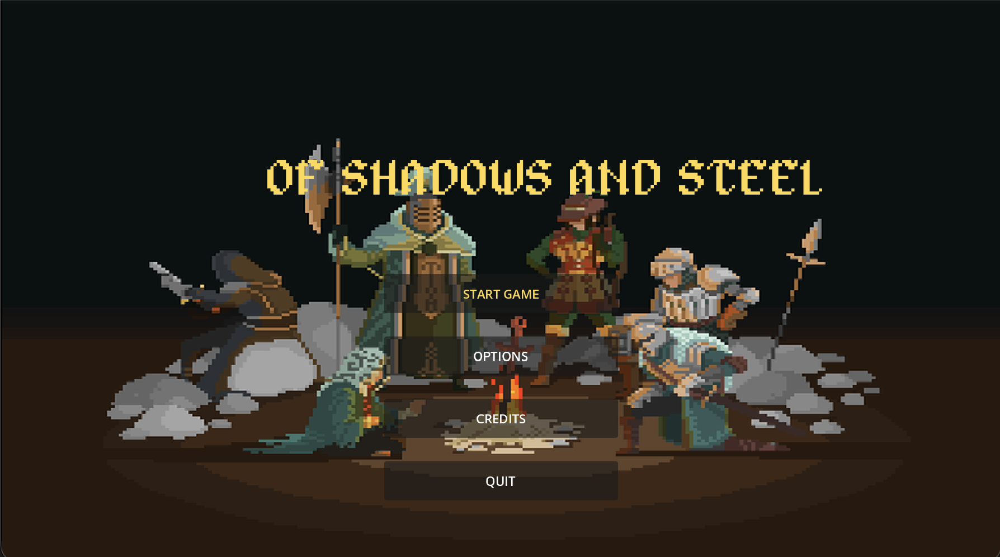
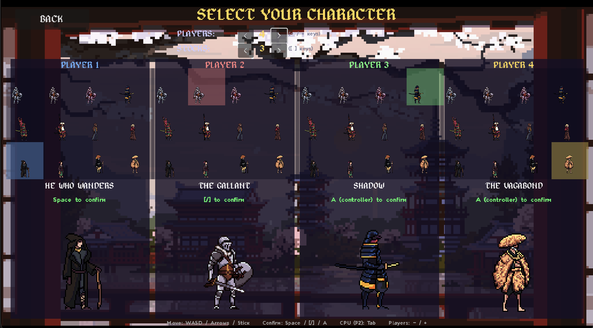

<div align="center">

# Of Shadows and Steel

*A 2D local multiplayer platform fighter*

[](https://seamuswoodruf.itch.io/of-shadows-and-steel)
[](https://godotengine.org)
[](https://www.bowdoin.edu)



</div>

---

*Of Shadows and Steel* is a 2D local multiplayer platform fighter built in Godot 4.6.2. Two to four person local multiplayer, or one player against a CPU opponent (which is admittedly not the greatest). Players can choose from a roster of twelve characters and fight on one of three stages.

While I had originally gone in the direction of a platform fighter because my roommates and I all love playing Super Smash Bros, I decided to pivot away from the floating platforms, side killzones, and damage-based system to a simpler-to-implement HP-based system with no side or roof killboxes.

---

## Screenshots

<div align="center">

| | |
|:---:|:---:|
|  |  |
| *Main Menu* | *Character Select (4-player)* |

</div>

---

## Roster

Twelve playable characters across four archetypes, each with a light attack, heavy attack, and two special inputs.

| Archetype | Characters | Special Mechanic |
|-----------|-----------|-----------------|
| **Knight** | Knight I, Knight II, Knight III | Block/defend, combo chain |
| **Samurai** | Samurai, Samurai Commander | Block, multi-hit dash |
| **Ranged** | Samurai Archer, Fire Wizard, Lightning Mage, Wanderer Magician | Projectiles, AOE, piercing shots |
| **Ninja** | Kunoichi, Ninja Monk, Ninja Peasant | Shuriken + heal, block + staff throw, blade + stone |

---

## Controls

### Keyboard
| Action | Player 1 | Player 2 |
|--------|----------|----------|
| Move | WASD | Arrow Keys |
| Jump | Space | `/` |
| Light Attack | Z | `.` |
| Heavy Attack | X | `,` |
| Special | C | `'` |
| Special 2 | V | `;` |

### Controller
All four attacks are bound to the right analog stick. Move with left stick/DPad, jump with A/Cross.

| Action | Binding |
|--------|---------|
| Move | Left Stick / DPad |
| Jump | A / Cross |
| Light Attack | Right Stick → |
| Heavy Attack | Right Stick ← |
| Special | Right Stick ↑ |
| Special 2 | Right Stick ↓ |

> **Browser players:** Click the game window first, then press any button on your controller to connect it.

---

## Stages

<!-- Add stage screenshots here -->

Three stages with hand-placed platform collision bodies, stage-specific music playlists, and ambient audio:

- **Windrise** — Lush meadow, open sky
- **Ruins** — Overgrown castle ruins with floating architecture  
- **Desert Temple** — Ancient sandstone ruins

Two stages use Gemini-generated backgrounds; one uses a free pixel art asset pack inspired by Genshin Impact's Mondstadt region.

---

## How It Was Built

The technical backbone of this project is a combination of **Godot 4.6.2**, an open-source game engine, and **Claude Code** running through a Model Context Protocol (MCP) server connection. With the Godot engine's MCP tools, Claude Code can run the game, read debug output, create scenes, and add nodes. Paired alongside multiple instances of Claude Cowork I was able to build a beginning file structure for the game, find and correctly organize assets, research the necessary game mechanics, and write a series of `.md` files that detailed the phases for Claude Code to follow during the initial build, and then further instruction files once we got to the heavy debugging, balancing, expanding, and polishing work later in the project.

What this meant in practice: I would describe what I wanted to build, read and edit Cowork's proposed implementation doc, catch issues before they were passed to Code, request corrections, and then pass the instruction files over to Code to implement. I would then run cycles of the gameplay debug preview window to find bugs and issues with the game, before detailing the necessary fixes back to Claude Code.

In theory, I planned to operate solely as architect, quality controller, and game designer — specifying systems, reviewing implementations, catching logical errors, and making judgment calls about design. In reality this was only partially how things went. Claude Code was pretty good at writing GDScript, and any manual edits I did need to make were straightforward enough that my knowledge of Python and Java made it fairly easy. What Claude Code struggles with is graphical interfaces: pretty much anything requiring interaction with a GUI I had to go and redo manually, which meant teaching myself how the Godot engine interface actually works. Essentially all of the stages, collision objects, and HUD elements I had to make and place manually, and then work to debug with Claude Code when my work led to gamebreaking bugs as it interacted with the GDScript Claude had written.

All of this meant that at every stage I had to have a solid idea of everything being built, where it lived in the project, what scripts controlled what, and what interactions existed so I could catch the frequent bugs that occurred as Claude Code built one thing and simultaneously broke another. I was also in a constant battle to manage Claude Code's context window so that it didn't randomly hallucinate after compacting the conversation and start reverting changes we'd made or reimplementing something we'd already tested and discarded — this happened multiple times.

In total I'd estimate this project probably took me in the neighborhood of 40–50 hours to complete — not my original intention — and that's not including the time spent setting up the game engine and MCP server, or accounting for time lost when I completely bricked my computer and lost everything since my last GitHub commit, plus setting up a completely new computer (luckily I was on top of pushing commits). Still, I think it's pretty remarkable how capable Claude Code was in this project and in game development generally. Prior to agentic AI, there is simply no way I could have achieved anything close to this in this amount of time, with zero game development knowledge, in a game engine I'd never used, running a coding language I had no experience with.

---

## Technical Details

```
Engine:         Godot 4.6.2 (GDScript)
Platform:       macOS native + Web (HTML5)
Characters:     12 playable, 6 scripts (base class + subclasses)
Stages:         3 (hand-placed platforms, parallax backgrounds)
Audio:          48 SFX groups, per-stage music playlists, ambient loops
VFX:            Sprite-sheet parser, 2,283 animations loaded at startup
AI:             5-state machine (approach/attack/retreat/recover/idle)
Multiplayer:    Local, 2–4 players, keyboard + controller
```

---

## What Was Hard

The devlogs document over forty distinct bugs across twelve development phases. Some were simple (wrong collision layer numbers), some were subtle (a race condition between a hurt animation ending and a hitstun timer expiring that caused characters to freeze permanently), some were architectural (a VFX system that treated each PNG as a single frame instead of a sprite sheet, flooding the screen with 768×576 explosion pixel blocks during gameplay), and some just made me want to toss my computer out a window.

A few specific ones worth noting:

**The multi-hit bug** — single attacks were dealing two or three times their stated damage. The cause: each physics frame, `_on_sprite_frame_changed()` re-evaluated whether a hitbox should be active. But `set_deferred("monitoring", false)` queues its execution to the end of the frame — on the next frame the callback re-enables monitoring, and the still-overlapping areas fire `area_entered` a second time. A three-frame active window reliably produced three hits. Fix: a `_hit_connected` flag that blocks re-enablement after first contact.

**The state machine freeze** — characters would freeze permanently in hurt states because the animation timer and the hitstun timer could disagree about when to exit. The fix was a single architectural decision: state exit logic must live in a timer tick, not an animation finished callback, because timers and animation lengths are not guaranteed to resolve in the same order.

**The 96-pixel frame size problem** — the three ninja characters used 96×96 pixel sprite frames instead of the 128×128 standard. Because frame slicing is computed as `image_width / frame_size`, passing the wrong size produces wrong frame counts silently. The fix required detecting the frame size per character and parameterizing the sprite builder.

The full maker's statement covering the development process, technical challenges, and reflections on human vs. AI creative labor is in [`MAKERS_STATEMENT.md`](MAKERS_STATEMENT.md).

---

## Course Context

This project was made for **DCS 247: AI in the World** at Bowdoin College (Spring 2026).

---

## Credits

**Development** — Seamus Woodruff  
**AI Coding Assistant** — Claude Code (Anthropic)

**Battle Music** — PeriTune — "Battle Tracks" JRPG Battle Music Pack ([peritune.com](https://peritune.com))  
**Menu & Ambient Music** — alkakrab ([alkakrab.itch.io](https://alkakrab.itch.io)), HitsLab  
**UI Sounds** — leohpaz — "10 Retro RPG Menu Sounds" (CC-BY, [opengameart.org](https://opengameart.org)), Lokif — "GUI Sound Effects" (CC0)  
**Fantasy SFX** — TomMusic ([tommusic.itch.io](https://tommusic.itch.io))  
**Character Sprites** — Craftpix.net — Medieval Sprite Packs  
**Homescreen GIF** — Sandy Gordon ([patreon.com/sandygordon](https://patreon.com/sandygordon))  
**Character Select Background** — Lennart Butz (ArtStation)  
**Options Screen Background** — vertibirdo ([deviantart.com/vertibirdo](https://deviantart.com/vertibirdo))  
**Windrise Background** — The Flavare — "Mondstadt" (itch.io)  
**Stage Backgrounds (Ruins, Desert Temple)** — Generated with Gemini  
**Fonts** — Alagard by Hewett Tsoi ([dafont.com](https://www.dafont.com/alagard.font)), Planes ValMore  
**Engine** — Godot 4.6.2 ([godotengine.org](https://godotengine.org))

---

<div align="center">

*Built with Godot 4.6.2 and Claude Code (Anthropic) via MCP*  
*Bowdoin College — DCS 247: AI in the World — Spring 2026*

[](https://seamuswoodruf.itch.io/of-shadows-and-steel)

</div>
